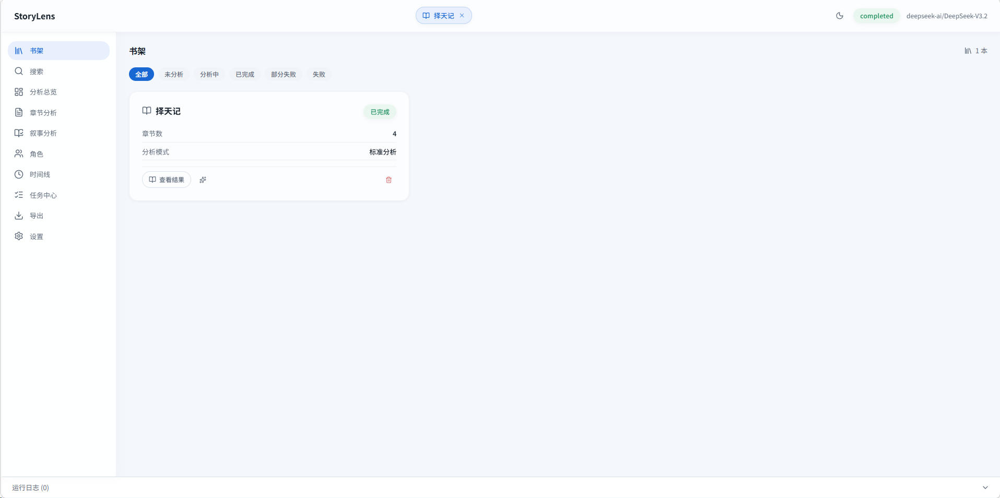
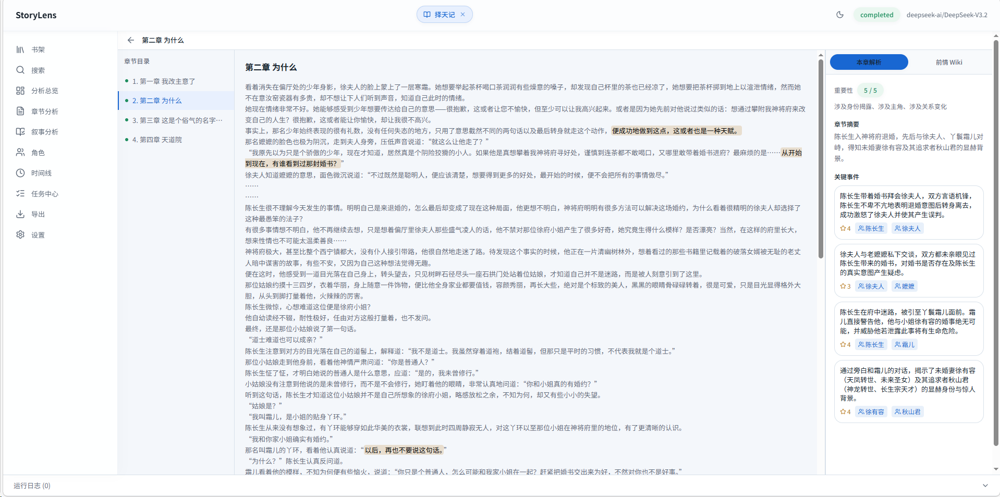
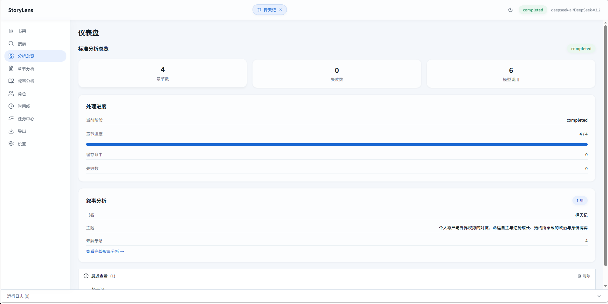
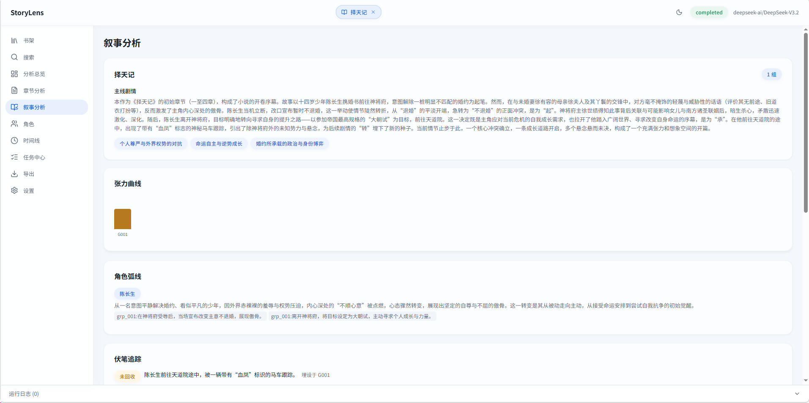
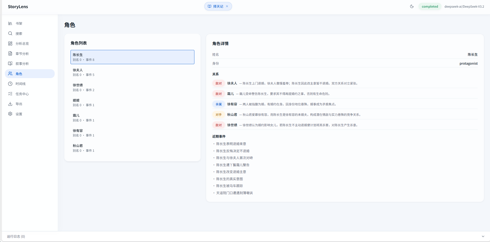
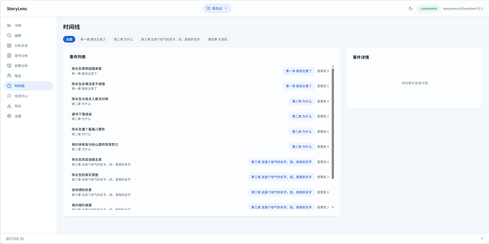
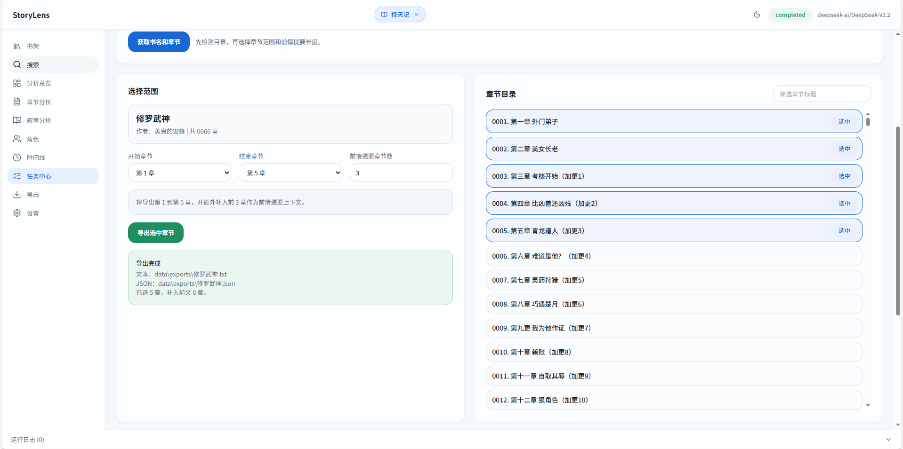

# 📖 StoryLens — Web Novel Intelligence Pipeline

<p align="center">
  <b>English</b> | <a href="./README.md">中文</a>
</p>

> Automatically extract structured story data from Chinese web novels: chapter summaries, key events, character relationships, narrative arcs — all in one click.


---

## 🎯 What is this?

**StoryLens** is an AI-powered analysis tool for Chinese web novels.

Chinese web novels often span hundreds or even thousands of chapters, making it hard for readers to grasp the full picture. StoryLens uses Large Language Models (LLMs) to **automatically analyze novels** — from genre identification and chapter segmentation to key event extraction, character tracking, and narrative arc generation — helping you understand the core content of a book in minutes.

Whether you are:
- 📖 **A reader** — Want to quickly evaluate if a novel is worth following, or recap forgotten plotlines
- 🎬 **A content adapter** — Need to map out story structure and character relationships for animation/comics/film adaptation
- 📊 **A researcher** — Want to analyze narrative patterns and character networks in web fiction
- 🛠️ **A developer** — Want to build on top of structured novel data

StoryLens has you covered.

## 💡 Why StoryLens?

| Advantage | Description |
|-----------|-------------|
| **One-Click Launch** | Double-click `start.bat` and you're ready — no complex setup |
| **Full Visual Pipeline** | Modern Web GUI: library → analysis → reader → search, all in your browser |
| **Minimal Dependencies** | Backend needs only `openai` + `requests`, no heavy frameworks |
| **Model Freedom** | Works with OpenAI / DeepSeek / Anthropic or any OpenAI-compatible API — use whatever fits your budget |
| **Smart Caching** | Same chapter never hits the LLM twice — saves money and time |
| **Incremental Analysis** | Novel updated? Only analyze new chapters, auto-merge with existing results |
| **Story Memory** | Cross-chapter tracking of characters, relationships, and plot threads for more coherent analysis |
| **Fully Local** | All data stored locally, nothing uploaded to third parties (except LLM API calls) |

## 📸 Screenshots

| Library | Reader (Original + Analysis) |
|:---:|:---:|
|  |  |

| Dashboard | Narrative Analysis |
|:---:|:---:|
|  |  |

| Characters | Timeline |
|:---:|:---:|
|  |  |

| Task Center (Crawl + Analysis) |
|:---:|
|  |

## ✨ Features

- **📝 Standard Analysis** — Genre classification → Chapter splitting → Key event extraction → Importance scoring, fully automated
- **📊 Narrative Analysis** — Two-layer narrative analysis: group summaries + book-level synthesis for complete story arc mapping
- **🧠 Story Memory** — Cross-chapter character/relationship/plot state tracking with alias normalization
- **🕷️ Web Crawling** — Fetch novels directly from index pages with chapter range selection and encoding support
- **📚 Bookshelf** — Multi-book management with independent analysis, supports incremental analysis (continue from previous runs)
- **🖥️ Web GUI** — Modern React frontend with bookshelf, reader, character profiles, timeline, and more
- **⚡ Smart Caching** — Cache keyed by book fingerprint + model + pipeline version, avoids redundant LLM calls
- **🔌 Multi-LLM Support** — Compatible with OpenAI / Anthropic / DeepSeek and any OpenAI-compatible API
- **🛑 Graceful Stop** — Stop analysis anytime; completed chapter results are preserved
- **🔄 Dual-Provider Failover** — Configure primary + secondary LLM providers with automatic failover

## 🏗️ Architecture

```
┌─────────────────────────────────────────────────────────────┐
│                    React GUI (Vite + TS)                     │
│  Library │ Tasks │ Dashboard │ Reader │ Characters │ Search  │
└────────────────────────┬────────────────────────────────────┘
                         │ HTTP API
┌────────────────────────▼────────────────────────────────────┐
│             Python API Server (stdlib HTTP)                  │
│  ┌──────────┐ ┌───────────┐ ┌──────────┐ ┌───────────────┐ │
│  │ Book Mgmt│ │ Pipeline  │ │ Crawler  │ │ Static Files  │ │
│  └──────────┘ └─────┬─────┘ └──────────┘ └───────────────┘ │
│                     │                                       │
│  ┌──────────────────▼──────────────────────────────────────┐│
│  │           standard_analysis pipeline                     ││
│  │  Genre → Chapter Split → Parallel Extraction → Scoring  ││
│  │                    ↓                                     ││
│  │           narrative_analyzer                             ││
│  │  Group Summaries → Book-level Synthesis                  ││
│  └─────────────────────────────────────────────────────────┘│
│  ┌─────────┐ ┌──────────┐ ┌──────────┐ ┌─────────────────┐ │
│  │LLM Client│ │  Cache   │ │  Memory  │ │ Schema Validator│ │
│  └─────────┘ └──────────┘ └──────────┘ └─────────────────┘ │
└─────────────────────────────────────────────────────────────┘
```

## 🚀 Quick Start

### Prerequisites

- Python 3.10+
- Node.js 18+ (only needed for frontend development)
- An OpenAI-compatible API key

### Installation

```bash
git clone https://github.com/Mengv0320/StoryLens.git
cd StoryLens

# Python dependencies
pip install -r requirements.txt

# Configure environment
cp .env.example .env
# Edit .env and fill in your API key
```

### One-Click Launch

```bash
# Windows
start.bat

# Linux/macOS
bash start.sh
```

Visit `http://localhost:8765` to use the full GUI.

### Development Mode

```bash
# Backend
python -m src.api_server

# Frontend (separate terminal)
cd gui && npm install && npm run dev
```

Frontend dev server runs at `http://localhost:5173` with API requests proxied to the backend.

> **Note:** Set `NO_PROXY="*"` before starting the API server if you have a system proxy, to avoid ProxyError/SSLEOFError.

## 📖 Usage

### CLI — Standard Analysis

```bash
python -m src.main input.txt --output result.json
python -m src.main input.txt --output result.json --model deepseek-chat --use-cache
```

### CLI — Web Crawling

```bash
# Crawl and save as text
python -m src.main --crawl-url https://example.com/novel/ --output novel.txt

# Crawl chapters 1-50 only
python -m src.main --crawl-url https://example.com/novel/ --chapter-start 1 --chapter-end 50

# List available chapters
python -m src.main --crawl-url https://example.com/novel/ --list-chapters
```

### GUI Pages

| Page | Description |
|------|-------------|
| 📚 Library | Multi-book management, one-click analysis, delete/clean |
| 📋 Tasks | Start/stop analysis pipeline, real-time progress |
| 📊 Dashboard | Chapter stats, key characters, story stages |
| 📖 Reader | Side-by-side original text and analysis comparison |
| 👥 Characters | Character list, details, event participation |
| 🕐 Timeline | Story event timeline visualization |
| 📈 Narrative | Group summaries + book-level narrative synthesis |
| 🔍 Search | Full-text search across chapters and events |
| ⚙️ Settings | API configuration, model selection, parameter tuning |

## ⚙️ Environment Variables

| Variable | Required | Description |
|----------|----------|-------------|
| `OPENAI_API_KEY` | ✅ | LLM API key |
| `OPENAI_MODEL` | | Model name (default: `gpt-4o`) |
| `OPENAI_BASE_URL` | | API endpoint (supports proxies / self-hosted) |
| `OPENAI_TYPE` | | Provider type: `openai` (default) or `anthropic` |
| `OPENAI_API_KEY_2` | | Secondary provider API key |
| `OPENAI_BASE_URL_2` | | Secondary provider endpoint |
| `API_TOKEN` | | API access token (auth disabled if not set) |

See [`.env.example`](./.env.example) for the full list.

## 📂 Project Structure

```
src/
  api_server.py          HTTP API server (stdlib ThreadingHTTPServer)
  standard_analysis.py   Standard analysis pipeline orchestrator
  narrative_analyzer.py  Two-layer narrative analysis
  stages.py              LLM clients (OpenAI / Anthropic / MultiProvider)
  story_memory.py        Cross-chapter story memory system
  web_crawler.py         Web novel crawler
  book_index.py          Book index management
  rule_scoring.py        Rule-based importance scoring
  chaptering.py          Chapter splitting from raw text
  main.py                CLI entry point
gui/
  src/pages/             13 feature pages
  src/components/        Reusable UI component library
  src/lib/               API client, types, custom hooks
prompts/                 LLM prompt templates (5 templates)
schemas/                 JSON Schema definitions (5 schemas)
data/                    Runtime data (gitignored)
```

## 🔧 Tech Stack

**Backend:** Python 3.10+ · stdlib `http.server` · OpenAI SDK · Multi-threaded parallelism

**Frontend:** React 19 · TypeScript 5.9 · Vite 8 · TailwindCSS 3 · Lucide Icons · React Router 7

**Minimal Dependencies:** Backend requires only `openai` and `requests`

## 📄 License

[MIT](./LICENSE)